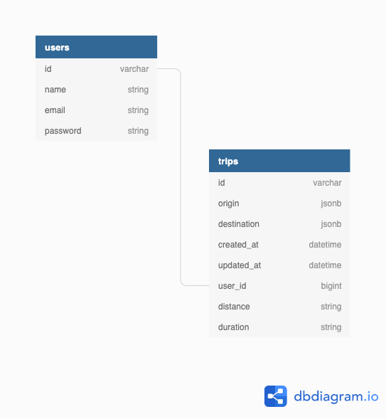

# Tripedia [](https://travis-ci.org/pschlatt/Tripedia)
Tripedia - Your trips encyclopedia!  This repository hosts the backend functionality for the Tripedia app.  Both the front-end and back-end were created in a 13 day period between 5 students.  In order to create users, login users, and render routes/attractions, this application hosts a variety of API endpoints that are consumed by https://tripedia-fe.herokuapp.com/ in an attempt to help prove that "Life is about the journey, not just the destination".
#### Frontend Repository
- https://github.com/davidagitlen/Tripedia-fe

## Authors
- [Glynnis O'Connell](https://github.com/GlynnisOC)
- [David Gitlen](https://github.com/davidagitlen)
- [Brandy Mello](https://github.com/BrandyMello)
- [Christopher Lane](https://github.com/CLLane)
- [Paul Schlattmann](https://github.com/pschlatt)

## Tech Stack
- Ruby 2.6.3p62
- Rails 5.2.3
- PostgreSQL 11.5
- RSpec 3.8
- Travis CI 1.8.10

## Schema


## Setup
- Open your CLI 
- run ```$ git clone https://github.com/pschlatt/Tripedia.git```
- run ```$ cd Tripedia```
- run ```$ bundle install```
- run ```$ rails db:{create,migrate}```
- run ```$ rails s``` and thats it! You can now test some endpoints via Postman.

## Example Endpoints 
#### POST 
```/api/v1/users?name=Paul&email=Paul@gmail.com&password=123&password_confirmation=123``` 
#### POST
```/api/v1/user_login?email=Paul@gmail.com&password=123```
#### POST
```/api/v1/users/1/trips?origin=Denver,CO&destination=Taos,NM```

## Example Responses
#### POST 
User Creation
```
{
    "id": 3,
    "name": "Paul",
    "email": "Paul@gmail.com",
    "password": "123",
    "account_created": true
}
```
#### POST 
User Login
```
{
    "id": 3,
    "name": "Paul",
    "email": "Paul@gmail.com",
    "logged_in": true
}
```
#### POST 
Trip Creation
```
{
    "trip": {
        "id": 10,
        "origin": "{\"lat\":39.7392358,\"lng\":-104.990251}",
        "destination": "{\"lat\":36.4072485,\"lng\":-105.5730665}",
        "created_at": "2019-10-31T07:22:50.806Z",
        "updated_at": "2019-10-31T07:22:50.806Z",
        "user_id": 3,
        "distance": "287 mi",
        "duration": "4 hours 42 mins"
    },
    "attractions": [
        [
            {
                "id": "Zd_IyS0Z8eL0RRQZ9LCwfw",
                "alias": "denver-selfie-museum-denver",
                "name": "Denver Selfie Museum",
                "image_url": "https://s3-media2.fl.yelpcdn.com/bphoto/MVTiRjcJUHL_4Z4NqYSVJg/o.jpg",
                "is_closed": false,
                "url": "https://www.yelp.com/biz/denver-selfie-museum-denver?adjust_creative=lQBDH1JJAA5pG8BZW_9NVQ&utm_campaign=yelp_api_v3&utm_medium=api_v3_business_search&utm_source=lQBDH1JJAA5pG8BZW_9NVQ",
                "review_count": 13,
                "categories": [
                    {
                        "alias": "artmuseums",
                        "title": "Art Museums"
                    }
                ],
                "rating": 4.5,
                "coordinates": {
                    "latitude": 39.74951,
                    "longitude": -104.99926
                },
                "transactions": [],
                "location": {
                    "address1": "1525 Market St",
                    "address2": null,
                    "address3": "",
                    "city": "Denver",
                    "zip_code": "80202",
                    "country": "US",
                    "state": "CO",
                    "display_address": [
                        "1525 Market St",
                        "Denver, CO 80202"
                    ]
                },
                "phone": "+13033280104",
                "display_phone": "(303) 328-0104",
                "distance": 1378.664849385034
            },
            {
                "id": "w5qZB2uaL_k4amssvXrs5w",
                "alias": "dagar-denver",
                "name": "DAGAR",
                "image_url": "https://s3-media1.fl.yelpcdn.com/bphoto/D3t08gram6qrAIV17dhlmQ/o.jpg",
                "is_closed": false,
                "url": "https://www.yelp.com/biz/dagar-denver?adjust_creative=lQBDH1JJAA5pG8BZW_9NVQ&utm_campaign=yelp_api_v3&utm_medium=api_v3_business_search&utm_source=lQBDH1JJAA5pG8BZW_9NVQ",
                "review_count": 48,
                "categories": [
                    {
                        "alias": "bars",
                        "title": "Bars"
                    },
                    {
                        "alias": "axethrowing",
                        "title": "Axe Throwing"
                    },
                    {
                        "alias": "galleries",
                        "title": "Art Galleries"
                    }
                ],
                "rating": 5.0,
                "coordinates": {
                    "latitude": 39.75232,
                    "longitude": -104.99145
                },
                "transactions": [],
                "location": {
                    "address1": "2000 Lawrence St",
                    "address2": "",
                    "address3": null,
                    "city": "Denver",
                    "zip_code": "80205",
                    "country": "US",
                    "state": "CO",
                    "display_address": [
                        "2000 Lawrence St",
                        "Denver, CO 80205"
                    ]
                },
                "phone": "+17203898699",
                "display_phone": "(720) 389-8699",
                "distance": 1460.877146168355
            }(etc...)
```


